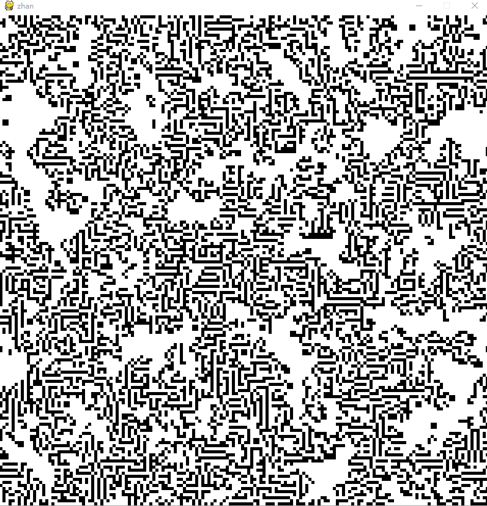

## What is it?

元胞自动机（ Cellular Automata） 是 20 世纪50 年代初由计算机之父冯·诺依曼（J.von Neumann） 为了模拟生命系统所具有的自复制功能而提出来的。此后，史蒂芬·沃尔夫勒姆（Stephen Wolfram） 对元胞自动机理论进行了深入的研究，例如，他对一维初等元胞机全部256 种规则所产生的模型进行了深入研究，并将元胞自动机分为平稳型、周期型、混沌型和复杂型4 种类型。元胞自动机采用离散的空间布局和离散的时间间隔，将元胞分成有限种状态，元胞个体状态的演变仅与其当前状态以及其某个局部邻域的状态有关。

## How to run?

- Need `Python3` and `pip3`
  - `pip install pygame` 
  - `python3 ./cellular_automata.py`

## How is the effect?

