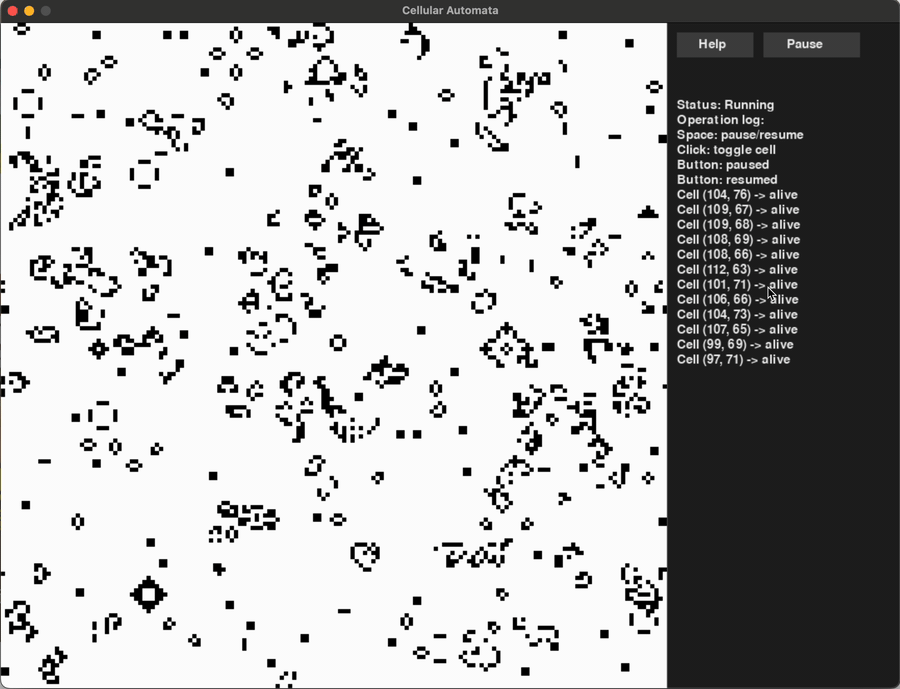

# Python Cellular Automata

[English](./README.md) | 中文

一个使用 Python 和 Pygame 实现的二维元胞自动机演示项目。当前规则采用经典的康威生命游戏（Conway's Game of Life）：每个细胞的下一状态由周围 8 个邻居的存活数量决定，并以黑白网格动画的形式展示演化过程。



## 功能特性

- 使用 `pygame` 绘制 800 x 800 的自动机网格，并在右侧显示多行操作日志
- 默认网格规模为 `160 x 160`
- 默认随机初始化 4800 个存活细胞
- 每一轮根据周围 8 个邻居计算细胞生死
- 边界使用上下、左右连通的环形空间
- 每 tick 只重绘发生状态变化的细胞
- 支持按空格键暂停或继续演化
- 支持鼠标左键点击细胞，手动触发或杀掉它
- 右侧日志面板以 ASCII 文本显示当前运行状态和最近多条用户操作
- 右侧提供 `Help` 按钮，介绍规则和玩法
- 右侧提供 `Pause` / `Resume` 按钮，控制自动演化

## 运行环境

- Python 3
- pygame

安装依赖：

```bash
pip3 install pygame
```

运行项目：

```bash
python3 cellular_automata.py
```

启动后会打开一个 Pygame 窗口：

- 黑色方格表示存活细胞
- 白色方格表示死亡细胞
- 按 `Space` 暂停或继续
- 点击右侧 `Pause` / `Resume` 暂停或继续
- 鼠标左键点击细胞可切换其存活状态
- 点击右侧 `Help` 查看游戏与玩法说明
- 在 Help 窗口中按 `Esc` 或点击 `Close` 关闭说明
- 右侧日志面板会显示最近几次点击或暂停/继续操作日志
- 关闭窗口退出程序

## 项目结构

```text
.
├── README.md
├── README_zh.md
├── box.py
├── cellular_automata.py
└── 元胞自动机.gif
```

- `cellular_automata.py`：程序入口，负责初始化窗口、随机生成初始细胞、处理事件和绘制画面
- `box.py`：定义 `Cell` 和 `Box`，负责维护网格、查找邻居、执行生命游戏规则
- `元胞自动机.gif`：运行效果示例

## 核心规则

每个细胞只有两种状态：

- `1`：存活
- `0`：死亡

每次刷新时，程序统计当前细胞周围 8 个邻居中的存活数量，并应用以下规则：

- 存活细胞周围存活邻居少于 2 个时死亡
- 存活细胞周围有 2 或 3 个存活邻居时保持存活
- 存活细胞周围存活邻居多于 3 个时死亡
- 死亡细胞周围正好有 3 个存活邻居时复活

## 可调整参数

可以在 `cellular_automata.py` 顶部修改以下配置：

```python
grid_width = 800
grid_height = 800
log_panel_width = 280
win_width = grid_width + log_panel_width
win_height = grid_height
row_cell_num = 160
life_num = 4800
max_log_lines = 40
frame_rate = 60
simulation_interval_ms = 1000
```

- `grid_width` / `grid_height`：自动机网格宽度和高度
- `log_panel_width`：右侧日志面板宽度
- `win_width` / `win_height`：窗口总宽度和高度
- `row_cell_num`：每行、每列的细胞数量
- `life_num`：初始化时随机生成的存活细胞数量
- `max_log_lines`：右侧日志面板最多显示的操作日志行数
- `frame_rate`：窗口事件处理和界面刷新的帧率
- `simulation_interval_ms`：自动机每次演化的间隔，单位为毫秒

程序使用 `frame_rate` 保持鼠标和键盘输入响应，同时用 `simulation_interval_ms` 单独控制自动机演化速度。默认每 1000 毫秒演化 1 次；若希望动画更快，可以调小这个数值。

## 实现说明

`Box.flush()` 会先复制当前网格状态，再基于旧状态计算所有细胞的下一状态。这样可以避免某个细胞提前更新后影响同一轮中其他细胞的判断。

刷新完成后，`flush()` 只返回状态发生变化的细胞，主循环再调用绘制函数重绘这些格子，从而减少不必要的绘制操作。

## 背景简介

元胞自动机（Cellular Automata）是一类由离散空间、离散时间和有限状态组成的计算模型。每个元胞的状态会根据自身及邻域状态按固定规则同步更新。康威生命游戏是其中最著名的二维元胞自动机之一，它使用非常简单的局部规则，却能产生丰富、复杂的动态结构。
